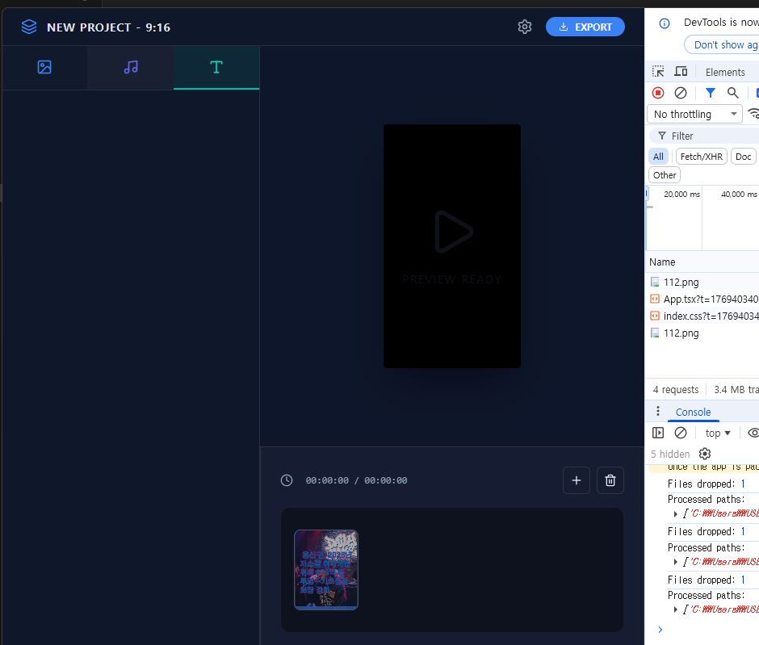

# Antigravity Movie Maker



이미지와 오디오를 결합하여 고품질 MP4 영상을 생성하는 Electron 기반 데스크톱 애플리케이션입니다.

## 주요 기능
- **미디어 관리**: 다중 이미지 업로드 및 오디오(MP3) 연동
- **지능형 자막 생성**: 긴 텍스트를 입력하면 영상 길이에 맞춰 자동으로 여러 페이지의 자막(.srt) 생성 및 합성
- **렌더링 엔진**: 고성능 FFmpeg 기반 비디오 인코딩 및 자막 번인(Burn-in)
- **UI/UX**: 최신 글래스모피즘(Glassmorphism) 테마, 대폭 개선된 드래그 앤 드롭 인터페이스
- **자동 파일 명명**: 시스템 날짜(YYYYMMDD)를 기반으로 내보내기 파일명 자동 제안

## 업데이트 내역 (최신)
- **[2026.01.28] 자막 자동 생성 및 편의성 강화**
  - **텍스트 기반 자막 생성**: 별도의 자막 파일 없이도 입력한 텍스트를 줄 단위로 분할하여 전체 영상 시간에 맞춰 배분하는 로직 구현
  - **드래그 앤 드롭 해결**: 내보내기 완료 후에도 파일 추가가 가능하도록 상태 관리 수정 및 Windows 금지 마크 현상 해결
  - **기본 파일명 변경**: 내보내기 기본 파일명을 시스템 날짜(`YYYYMMDD.mp4`)로 설정
  - **UI 버튼 추가**: 창 최소화 및 닫기 버튼 추가

## FFmpeg 인코딩 설정 (Technical Specs)
이 프로젝트에서 사용된 핵심 FFmpeg 옵션 및 필터 설정은 다음과 같습니다. 특히 여러 장의 이미지를 합치고 자막을 오버레이하는 과정에서 발생한 기술적 이슈들을 해결하기 위한 최적화가 포함되어 있습니다.

### 1. 비디오 필터 구성 (`filter_complex`)
- **개별 스케일링 및 전처리**: `scale={w}:{h}:force_original_aspect_ratio=decrease,pad={w}:{h}:(ow-iw)/2:(oh-ih)/2,fps=25,setsar=1`
  - 각 이미지의 해상도가 다르더라도 `concat` 필터에서 에러가 발생하지 않도록, 모든 입력을 동일한 해상도로 맞춥니다.
  - `force_original_aspect_ratio=decrease`와 `pad`를 결합하여 이미지 왜곡 없이 비율을 유지하면서 부족한 부분을 검은색으로 채웁니다.
  - `fps=25` 명령을 통해 정지 이미지 루핑 시 발생할 수 있는 시간축 계산 오류(Invalid Argument)를 방지하고 프레임을 동기화합니다.
- **다중 이미지 연결 (Concat)**: `[v0][v1]...concat=n={count}:v=1:a=0[vconcat]`
  - 전처리가 끝난 비디오 스트림들을 하나의 시퀀스로 연결합니다.
- **자막 오버레이 (Drawtext & Subtitles)**:
  - **타이틀 (Drawtext)**: `drawtext=fontfile='...':text='...':fontcolor=white:fontsize=100:x=(w-text_w)/2:y={pos}:borderw=4:bordercolor=black:fix_bounds=true:line_spacing=20`
    - 고정된 제목이나 강조 문구를 입힐 때 사용합니다.
  - **자동 자막 (Subtitles)**: `subtitles='temp_sub.srt'` (Burn-in 방식)
    - 입력된 텍스트를 시간 단위로 쪼갠 임시 SRT 파일을 생성하여 영상 하단에 입힙니다.
    - Windows 경로 호환성을 위해 드라이브 콜론(`:`) 이스케이프 처리를 포함했습니다.
- **최종 포맷 변환**: `format=yuv420p`
  - 필터 체인의 마지막 단계에서 픽셀 포맷을 변환하여 모바일 및 웹 등 모든 환경에서 재생 가능한 범용성을 확보합니다.

### 2. 오디오 처리 및 동기화
- **Codec**: `aac` - 범용적인 고품질 오디오 코덱을 사용합니다.
- **Duration Control**:
  - `-loop 1 -t {duration}`: 각 이미지를 지정된 시간 동안 유지시킵니다.
  - `-t {totalDuration}`: 전체 영상의 길이를 오디오 길이에 맞춰 강제로 마감합니다.
  - `-shortest`: 입력 중 가장 먼저 끝나는 스트림(주로 비디오 스트림)을 기준으로 종료하여 잔상이 남지 않도록 합니다.

### 3. 주요 인코딩 옵션
- `-vcodec libx264`: CPU 기반의 가장 안정적이고 효율적인 비디오 코덱을 사용합니다.
- `-pix_fmt yuv420p`: 표준적인 색상 샘플링 방식을 사용하여 호환성을 극대화합니다.
- `-r 25`: 출력 영상의 프레임 레이트를 25fps로 고정하여 부드러운 재생을 구현합니다.

## 기술 스택
- **Frontend**: React 19, Vite 7, Tailwind CSS v4, Lucide React
- **Backend**: Electron 41, FFmpeg (via fluent-ffmpeg), ffmpeg-static, ffprobe-static

## FFmpeg 실제 실행 사례 분석 (Deep Dive)

아래는 애플리케이션에서 실제로 생성되어 실행된 명령어의 예시와 각 파트별 상세 설명입니다.

### 실행 명령어 예시
```bash
ffmpeg -loop 1 -t 3 -framerate 25 -i image1.png \
-loop 1 -t 34.8 -framerate 25 -i image2.jpeg \
-i music.mp3 -y \
-filter_complex \
"[0:v]scale=1080:1920:force_original_aspect_ratio=decrease,pad=1080:1920:(ow-iw)/2:(oh-ih)/2,fps=25,setsar=1[v0]; \
 [1:v]scale=1080:1920:force_original_aspect_ratio=decrease,pad=1080:1920:(ow-iw)/2:(oh-ih)/2,fps=25,setsar=1[v1]; \
 [v0][v1]concat=n=2:v=1:a=0[vconcat]; \
 [vconcat]drawtext=fontfile='malgun.ttf':text='자막 내용':fontcolor=white:fontsize=100:x=(w-text_w)/2:y=(h-th)/2:borderw=4:bordercolor=black:fix_bounds=true:line_spacing=20[vtitle]; \
 [vtitle]format=yuv420p[vout]; \
 [2:a]anull[aout]" \
-acodec aac -vcodec libx264 -map [vout] -map [aout] -pix_fmt yuv420p -t 37.8 -shortest -r 25 output.mp4
```

### 상세 옵션 설명

#### 1. 입력부 (Input Options)
*   **`-loop 1`**: 단일 이미지를 무한 반복하여 비디오 스트림으로 취급하게 합니다.
*   **`-t 3`**: 루프되는 이미지의 지속 시간을 지정합니다. (첫 이미지는 3초, 마지막 이미지는 잔여 시간만큼)
*   **`-framerate 25`**: 입력 단계에서 프레임 속도를 지정하여 인코딩 중 시간축 오차를 방지합니다.

#### 2. 필터부 (Complex Filter)
*   **`scale=1080:1920:force_original_aspect_ratio=decrease`**: 원본 비율을 유지하면서 타겟 해상도(9:16)에 맞게 크기를 줄입니다.
*   **`pad=1080:1920:(ow-iw)/2:(oh-ih)/2`**: 크기 조절 후 남는 공간을 중앙 정렬하고 검은색 여백(Letterbox)으로 채웁니다.
*   **`fps=25,setsar=1`**: 모든 입력 소스를 동일한 25fps로 강제하고, 픽셀 종횡비를 1:1로 고정하여 합치기(`concat`) 시 발생하는 호환성 에러를 차단합니다.
*   **`concat=n=2:v=1:a=0`**: `n=2`개의 비디오 소스를 하나의 비디오 스트림으로 연결합니다.
*   **`drawtext`**: 폰트 파일 경로, 텍스트 위치(`x, y`), 외곽선 두께 등을 설정하여 영상 위에 자막을 얹습니다.
*   **`format=yuv420p`**: 인코딩 결과물이 가장 대중적인 픽셀 포맷을 갖도록 변환하여 안드로이드, iOS, 웹 어디서든 재생되게 합니다.

#### 3. 출력부 (Output Options)
*   **`-acodec aac` / `-vcodec libx264`**: 표준적인 오디오/비디오 코덱을 설정합니다.
*   **`-map [vout] -map [aout]`**: 필터 연산을 통해 최종 생성된 비디오(`vout`)와 오디오(`aout`)를 출력 파일에 담도록 명시합니다.
*   **`-shortest`**: 이미지 정지 시간과 오디오 시간 중 짧은 쪽에서 영상을 종료하여 싱크를 맞춥니다.
*   **`-r 25`**: 최종 출력물의 프레임 레이트를 25fps로 확정합니다.
